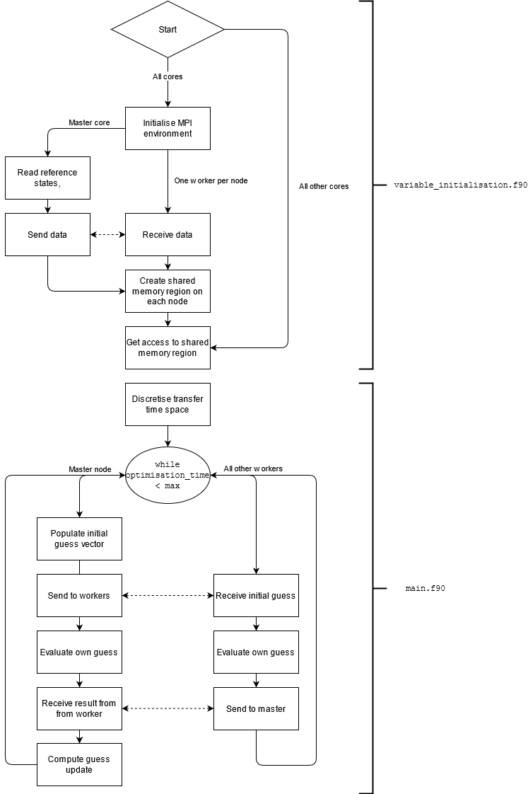

# Optimisers for finding EROs

## Introduction

These software tools form the final portion of the ERO analysis pipeline. Both use MIDACO and function similarly. Two tools are included:

* `global_search`: Contains software to perform the initial global search on _retrieval candidates_.
* `pareto_front`: Contains software to construct the Pareto fronts from `EROs` found after the initial search.

Both are written in Fortran, compliant to the 2008 standard, and require the MPI library to function.

## How do they work?

The flowchart above gives the high-level overview of the variable initialisation routines and the parallelism implementation in the variable initialisation and cost function. 

In slightly more gory detail, the programs are designed to work with almost any memory architecture, be it a local desktop machine with a shared memory architecture, or a
supercomputing cluster with hundreds of nodes and a distributed architecture. The MPI parallel programming paradigm is used in combination with its shared memory space functionality to ensure that datasets are only replicated where needed. For more information, I recommend ARCHER's lecture on  the [MPI Shared Memory Model](http://www.archer.ac.uk/training/course-material/2018/04/adv-mpi-exeter/Slides/L19-RMA-shared-memory.pdf).

The user provides several datasets containing the required information necessary for the optimisation (see later...). The subroutines in `variable_initialisation.f90` will then detect the memory architecture in use, and replicate datasets such that every shared memory space has at exactly one copy of each dataset. A shared memory 'window' will be opened in each shared memory space, to which every worker in the shared memory system will receive a pointer to the data. This reduces commnunication overheads and memory requirements.

> As an example, a supercomputer with, say, 4 nodes with 40 cores per node, has 4 separate shared memory regions - one per node - with each one distributed from the other. Thus, the dataset will be replicated four times across the 160 workers.  On the other hand, a desktop machine will have one single memory space for every core on the host processor.

The candidates to optimise - or generate the Pareto fronts for - are then read in. The program being used dictates how this data is partitioned among the workers; for the Pareto front generation codes, the objective function evaluation is parallelised, such that for _n_ workers, _n_ function evaluations are performed simultaneously. For the general optimisation codes, _n_ asteroids are optimised simultaneously. Scaling is nearly linear across the latter, but slightly worse in the former.

## How do I build the programs?

Both programs have the same dependencies and the same build system; the only difference is in how you configure the solvers. These dependencies are:

* [BOOST](https://www.boost.org/)
* [OpenMP](https://www.openmp.org/)
* [Message-Passing Interface](https://www.mpich.org/) MPICH is officially supported, although any MPI implementation that supports Fortran will do.
* [CMake](https://cmake.org/)
* [SPICE](https://naif.jpl.nasa.gov/naif/)
* [Fortran Astrodynamics Toolkit](https://github.com/jacobwilliams/Fortran-Astrodynamics-Toolkit)
* [Fortran B-Spline Library](https://github.com/jacobwilliams/bspline-fortran)
* [MIDACO](https://midaco-solver.com) - this is a paid optimiser for more than 4 design variables. The Pareto front generation will thus run on a free version, but the general optimisation won't.

Both the Astrodynamics toolkit and B-Spline library are kindly provided by [Jacob Williams](https://github.com/jacobwilliams); his codes also depend on [FoBiS.py](https://github.com/szaghi/FoBiS), an automated build library for Fortran written in Python.

> If you're wanting to reproduce this research _without_ access to a full version of MIDACO for whatever reason, please get in touch. I would be more than happy to discuss how to adapt the code to work with your optimiser.

To build, simply type `sh build.sh` at the terminal. It _should_ just work.
## How do I use the programs?

In general, you need only edit the `problem_parameters.f90` file for each tool. However, see the more detailed instructions in each of the sub-folders for more information, or get in touch.

