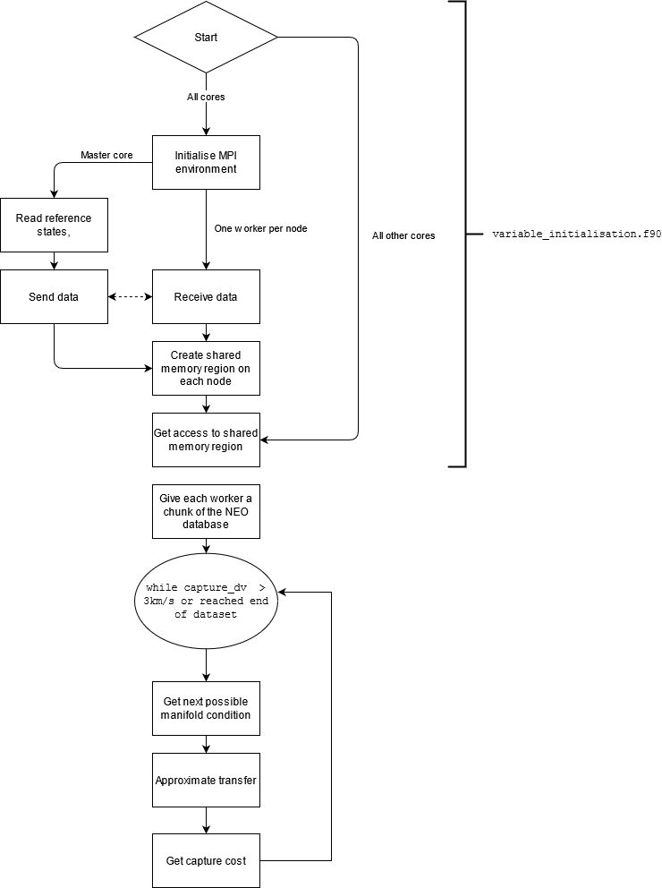

# The Fortran Asteroid Prefilter

This program implements the prefiltering methodology for identifying _retrieval candidates_ from a given list of NEOs. The methodology was originally developed in Sánchez, J. P., & García Yárnoz, D. (2016). Asteroid retrieval missions enabled by invariant manifold dynamics. Acta Astronautica, 127, 667–677. https://doi.org/10.1016/j.actaastro.2016.05.034.

## How does it work?

 

The flowchart above gives the high-level overview of the variable initialisation routines and the parallelism implementation in the variable initialisation . 

In slightly more gory detail, the programs are designed to work with almost any memory architecture, be it a local desktop machine with a shared memory architecture, or a
supercomputing cluster with hundreds of nodes and a distributed architecture. The MPI parallel programming paradigm is used in combination with its shared memory space functionality to ensure that datasets are only replicated where needed. For more information, I recommend ARCHER's lecture on  the [MPI Shared Memory Model](http://www.archer.ac.uk/training/course-material/2018/04/adv-mpi-exeter/Slides/L19-RMA-shared-memory.pdf).

The user provides several datasets containing the required information necessary for the prefilter (see later...). The subroutines in `variable_initialisation.f90` will then detect the memory architecture in use, and replicate datasets such that every shared memory space has at exactly one copy of each dataset. A shared memory 'window' will be opened in each shared memory space, to which every worker in the shared memory system will receive a pointer to the data. This reduces commnunication overheads and memory requirements.

> As an example, a supercomputer with, say, 4 nodes with 40 cores per node, has 4 separate shared memory regions - one per node - with each one distributed from the other. Thus, the dataset will be replicated four times across the 160 workers.  On the other hand, a desktop machine will have one single memory space for every core on the host processor.

The candidates to estimate the transfer cost for are then read in. Each worker gets an equal (or close to equal if not exactly divisible) number of NEOs to compute.

## Build Instructions

To build this application, alter the compiler used by changing the `FC=` environment variable to the command which invokes the correct MPI wrapper to your compiler of choice. For example, `FC=mpifort`, `FC=mpif90`, `FC=mpiifort`.

Once done, re-comment or de-comment the compiler options in `CMakeLists.txt` to match whether the GNU or Intel compiler is being wrapped by MPI.

Running `build.sh` should automatically create the required folders, generate the makefiles and compile and link the program.

## Dependencies

* [NAIF Spice Toolkit](<https://naif.jpl.nasa.gov/naif/toolkit_FORTRAN.html>) -- used for determining ephemeris data

* `CMAKE` & `make` -- used for building all of the source codes

* The codes written by `jacobwilliams` also depend on [FoBiS.py](https://github.com/szaghi/FoBiS), an automated build system designed specifically for Fortran, and written in Python.

Dependencies should be compiled for your machine, with the library files placed in a folder called `lib/` in each of the program directories (the Spice Toolkit library will need to be renamed from `spicelib.a` to `libspice.a` to be coherent with CMAKE conventions for library naming.) Any generated module files should be placed in a folder called `mod/` in each of the program directories.

## Usage instructions

Create a folder called data/ in the root directory of the program. In it, the following files should be placed:

  * A valid planetary ephemeris file (for example, DE430s.)
  * A valid leapseconds file (for example, naif0008.)
  * Ephemeris files for any of the desired candidates. These may be downloaded using the `get_ephemeris` script located in this repository.
  * Data files for the manifold conditions; csv files with size n x 7, containing the backwards integration time in the synodic frame in column one, and the state vector in the remaining columns, where the units are in the synodic frame of the CR3BP.

The file `problem_parameters.f90` can then be adjusted to your particular problem.

## Tested compilers and platforms

MacOS, gfortran-8, gcc-8, ifort, intel-mpi, OpenMPI, MPICH, Python 3.6.

Ubuntu, gfortran-7, gcc-7, ifort, intel-mpi, OpenMPI, MPICH, Python 3.4.
Red Hat, gfortran-7, gcc-7, ifort, intel-mpi, OpenMPI, MPICH, Python 3.4.
